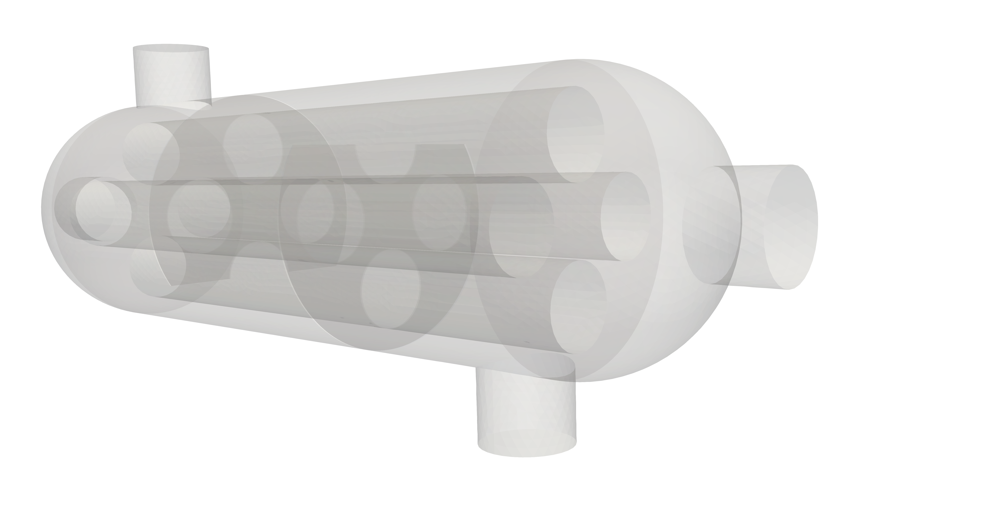
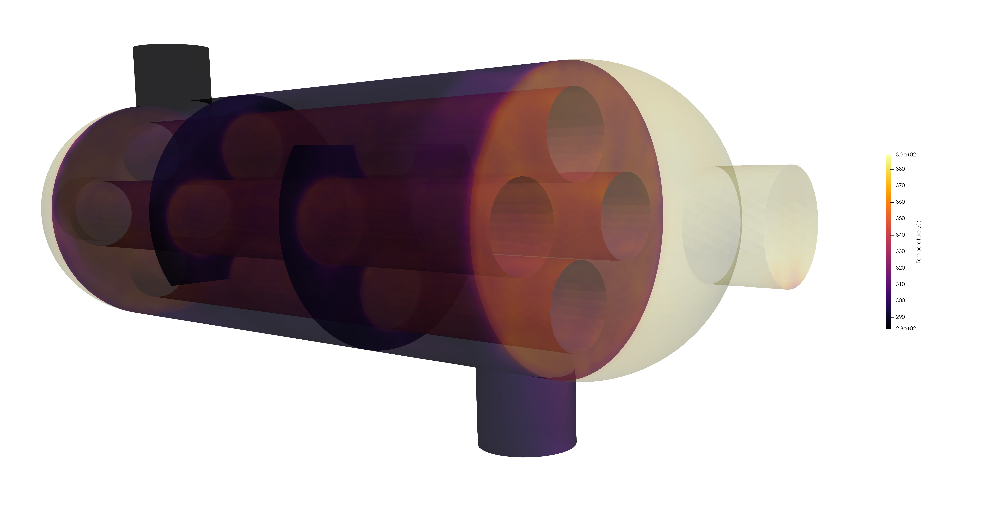
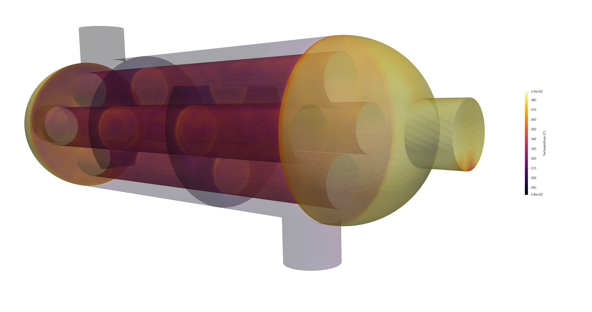
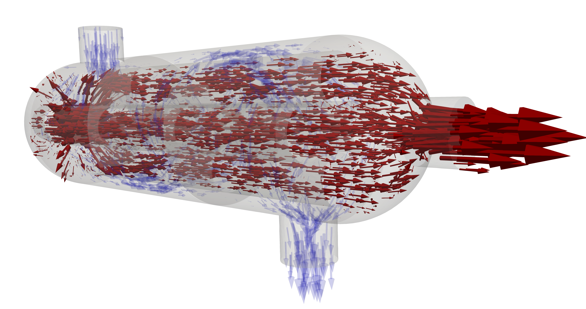

# OpenFOAM–FESTIM Heat Exchanger Demo

This repository demonstrates the coupling of [OpenFOAM](https://www.openfoam.com/) with [FESTIM](https://github.com/festim-dev/festim) for multiphysics simulations of a heat exchanger. OpenFOAM is used for the thermal-hydraulic analysis, and the results are then mapped to FESTIM for hydrogen transport modelling using [foam2dolfinx](https://github.com/festim-dev/foam2dolfinx).

### Heat exchanger model:

<p align="center">
    
</p>

The heat exchanger model is a very simplistic design with only 2 sections, hot and cold, with inlets and outlets for both sections.

Following completion of the OpenFOAM case produces the following fields:

### Temperature fields:

<table>
    <tr>
        <td align="left" width="50%">
            
        </td>
        <td align="right" width="50%">
            
        </td>
    </tr>
</table>

### Velocity fields:

<table>
    <tr>
        <td align="left" width="50%">
            
        </td>
        <td align="right" width="50%">
            
        </td>
    </tr>
</table>

These fields can then be passed to festim to be coupled with the hydrogen transport system producing the following field:

### Hydrogen transport:

<p align="center">
    
</p>

# Running the case

## 1. Installing OpenFOAM v2412

The case uses OpenFOAM version **v2412 (OpenCFD release)**.

```bash
# install OpenFOAM v2412
sudo apt install openfoam2412

# Source the environment (add to ~/.bashrc if needed)
source /usr/lib/openfoam/openfoam2412/etc/bashrc

# initialise openfoam
openfoam2412
```

## 2. Running the OpenFOAM Case

```bash
cd openfoam_data

# Run the simulation
chtMultiRegionSimpleFoam
```

## 3. Installing FESTIM and foam2dolfinx

FESTIM and foam2dolfinx can be installed in a conda environemnt using the `environment.yml` file:

```python
conda env create -f environment.yml
conda activate foam_festim_coupling_env
```

## 4. Running the FESTIM script

To export the OpenFOAM data as FEniCSx functions that can be read in Paraview to reproduce the fields shown above run the following file:

```python
python export_openfoam_data.py
```

To run the festim script:

```python
python festim_script.py
```


